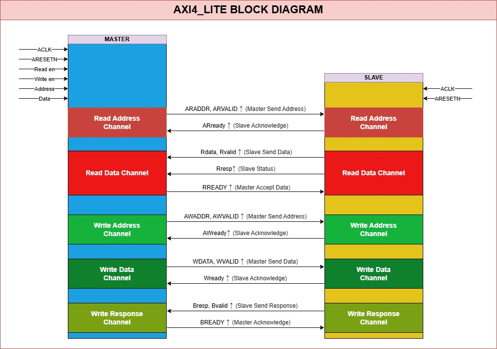
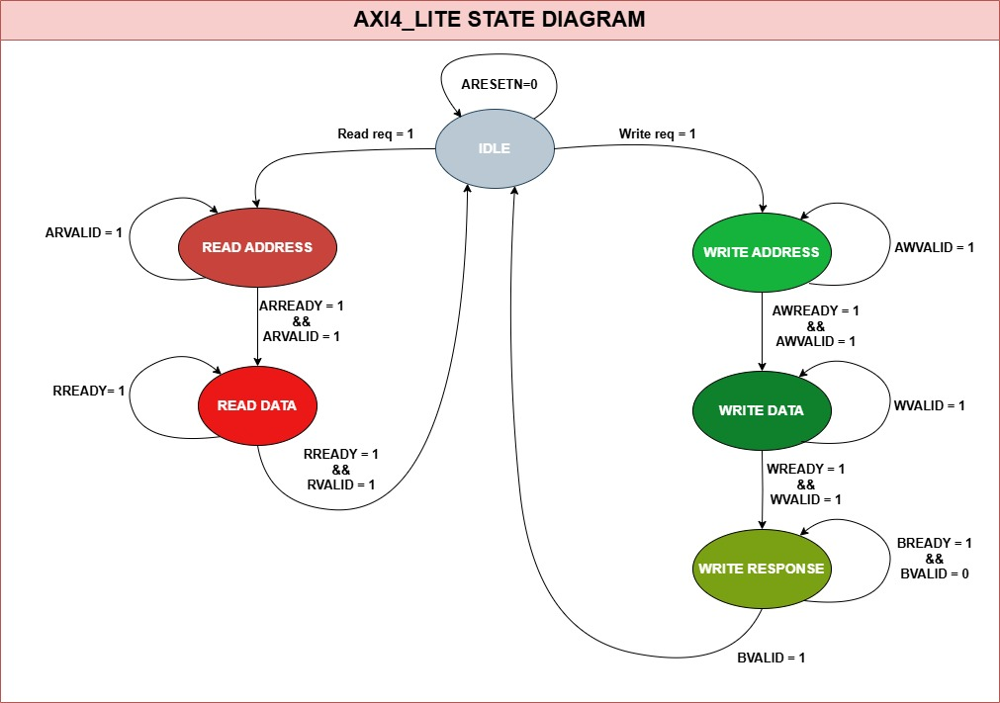

Got it! Here’s the **final README** with references included at the end.  

---

# **AXI4-Lite Interface Implementation**  

## 📌 **Introduction**  
AXI4-Lite is a **lightweight version of the AXI4 (Advanced eXtensible Interface)** protocol, designed for **low-bandwidth, memory-mapped communication**. It is widely used in **FPGA and ASIC designs** to connect simple peripherals that do not require high-speed data transfers.  

Unlike AXI4, AXI4-Lite **does not support burst transactions** and operates with a simpler **request-response** mechanism.  

---

## 🔍 **What is AXI4-Lite?**  
AXI4-Lite is part of the **AMBA (Advanced Microcontroller Bus Architecture)** specification developed by **ARM**. It is used for **register-based** communication between a **master** (e.g., CPU, DMA) and a **slave** (e.g., memory, peripheral).  

### **Key Features of AXI4-Lite:**  
- **Single transaction per request** (No burst support)  
- **Separate read and write channels**  
- **Handshaking mechanism for reliable data transfer**  
- **Supports multiple data widths (32-bit, 64-bit, etc.)**  
- **Simple control logic compared to AXI4**  

---

## 🤝 **Handshaking Protocol in AXI4-Lite**  
AXI4-Lite uses a **two-way handshake** between the master and the slave for each transfer. This ensures that **data is valid before being transferred**.  

### **AXI4-Lite Channels:**  
There are **five** channels in AXI4-Lite communication:  

1. **Write Address Channel (AW)**  
2. **Write Data Channel (W)**  
3. **Write Response Channel (B)**  
4. **Read Address Channel (AR)**  
5. **Read Data Channel (R)**  

Each channel has a **valid-ready handshake mechanism** to synchronize communication.  

### **Write Transaction (Master → Slave)**  
| Signal | Description |  
|---------|------------|  
| `AWVALID` | Master requests to write an address |  
| `AWREADY` | Slave acknowledges the address |  
| `WVALID` | Master sends write data |  
| `WREADY` | Slave is ready to receive data |  
| `BVALID` | Slave sends write response |  
| `BREADY` | Master acknowledges write completion |  

### **Read Transaction (Master ← Slave)**  
| Signal | Description |  
|---------|------------|  
| `ARVALID` | Master requests to read an address |  
| `ARREADY` | Slave acknowledges the request |  
| `RVALID` | Slave sends read data |  
| `RREADY` | Master acknowledges data reception |  

---

## 🔄 **State Machine-Based Implementation**  
We implement the AXI4-Lite protocol using a **Finite State Machine (FSM)** to control the behavior of both the **Master and Slave modules**.  

### **Why Use a State Machine?**  
A state machine helps:  
✅ **Control complex operations step by step**  
✅ **Ensure synchronization between Master and Slave**  
✅ **Avoid race conditions**  

### **State Machine for Write Operation**  
1. **IDLE** → Wait for `AWVALID & AWREADY`  
2. **WRITE_DATA** → Wait for `WVALID & WREADY`  
3. **WRITE_RESPONSE** → Wait for `BVALID & BREADY`  
4. **IDLE** → Transaction complete  

### **State Machine for Read Operation**  
1. **IDLE** → Wait for `ARVALID & ARREADY`  
2. **READ_DATA** → Wait for `RVALID & RREADY`  
3. **IDLE** → Transaction complete  

---

## ⚙️ **Implementation in Verilog/SystemVerilog**  
This repository contains an **AXI4-Lite Master and Slave implementation using Verilog/SystemVerilog**.  

### 📂 **Project Structure**  
```
AXI4_LITE/
│── srcs/                  # Source files
│   ├── sources_1/         # HDL sources
│   │   ├── AXI4_Lite_top.sv  # Top module
│   │   ├── M_AXI4_Lite.sv    # AXI4-Lite Master
│   │   ├── S_AXI4_Lite.sv    # AXI4-Lite Slave
│   ├── sim_1/             # Testbenches
│   │   ├── AXI4_Lite_top_tb.sv
├── images/
│   ├── AXI4_Lite Block Diagram.jpg
│   ├── AXI4_Lite State Diagram.jpg
│── README.md              # Project documentation
```


## 🏗️ AXI4-Lite Block Diagram  
The block diagram below illustrates the architecture of the **AXI4-Lite Master and Slave** design.  



## 🔄 State Machine Diagram  
The AXI4-Lite protocol is implemented using a **Finite State Machine (FSM)** to manage read and write transactions.  



---

### ✅ **How to Run the Simulation**  
1. Clone the repository:  
   ```sh
   git clone git@github.com:MuhammadWamiq003/AXI4_LITE.git
   cd AXI4_LITE
   ```
2. Open **Vivado** / **ModelSim**.  
3. Load the **testbench file** (`AXI4_Lite_top_tb.sv`).  
4. Run the simulation and observe the signals in the waveform viewer.  

## 📜 **References**  
For further reading and a deeper understanding of AXI4-Lite, refer to the following resources:  

1. **Real Digital - AXI4-Lite Protocol Overview**  
   [🔗 Read Here](https://www.realdigital.org/doc/a9fee931f7a172423e1ba73f66ca4081)  

2. **Official ARM AMBA AXI4 Specification**  
   [🔗 Read Here](http://www.gstitt.ece.ufl.edu/courses/fall15/eel4720_5721/labs/refs/AXI4_specification.pdf)  

---

## 🤝 **Contributing**  
Contributions are welcome! Fork the repo, create a branch, and submit a **pull request**.  
